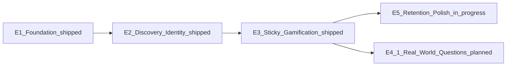

# Problem Bank — AI agent handoff

**Last updated:** 2026-08-20  
**Repository:** `maths_generator/physics-problem-bank` (GitHub: `kingdavidek/physics-problem-bank`)  
**Audience:** The next AI agent (or human) continuing product work  

Start here. Read the documents in the order below before changing behaviour that touches auth, grading, sessions, or the database.

---

## 1. Current product status

| Area | Status |
|------|--------|
| **Auto-correct (Phases A/B)** | Complete (GCSE CS + Maths; Python via client Pyodide) |
| **Phase G learning (G1–G7)** | Shipped (weak topics → exam revision planner) |
| **Solid-draft security bar** | Done (2026-08-01). See `docs/SOLID_DRAFT_SECURITY.md` |
| **Security + UK GDPR compliance** | **Planned, fully specified — `docs/SECURITY_AND_GDPR.md`.** Phase **S0 is a launch blocker**: no privacy notice, no account deletion, no data export, no DPIA, public-by-default profiles for a 13+ audience. Do S0 with (not after) `docs/MOBILE.md` M5 |
| **Mobile polish (app-like PWA)** | **Done (M0–M4)** — foundation, practice UX, app chrome, lessons/diagrams, PWA polish + device QA. **M5–M7** HTTPS → TWA → Play Android when a production URL exists — see `docs/MOBILE.md` |
| **Engagement roadmap (E1–E3)** | **E1–E3 shipped** (assist mock smoke, `@problem_bot` QOTD card, FTS lesson search, emoji/colour avatars, alien buddy, friend quiz-accuracy leaderboard). Visual tokens: `docs/ENGAGEMENT_VISUAL.md` |
| **G8 teacher / class mode** | Designed, not implemented. See `docs/POTENTIAL_FUTURE_FUNCTIONALITY.md` §2 |
| **Real-world question style (E4.1)** | **Planned, fully specified** — `docs/REAL_WORLD_QUESTIONS.md`. Third generator mode (`real_world`) across percentages, ratio, compound measures |
| **European School Integrated Science S1–S3** | **Planned, fully specified** — `docs/EUROPEAN_SCHOOL_SCIENCE.md`. New `eursc` level, 46 syllabus modules, variable lesson depth, mixed-format quizzes. Product decisions locked; ES0 platform enablement is next |
| **Engagement E5 (retention polish)** | **E5.2 shipped 2026-08-16** (four extra badges). **E5.1 partial on branch** `cursor/buddy-on-page-coach-embed` (faces, milestone toast, QOTD nudge, on-page coach, MCQ refetch, milestone dismiss — see §9). Rest planned — `docs/ENGAGEMENT_E5.md` |
| **Engagement stretch (E4.2–E4.3)** | Long-term — see `docs/POTENTIAL_FUTURE_FUNCTIONALITY.md` §3.0 (mascot farm, Desmos-class graphs) |
| **Git tip (post-hardening)** | Harden commit on `main`; history purged of `data/quicktest.db` |

**Do not regress solid-draft security** when shipping engagement or mobile work. Prefer extending existing models (QOTD, social feed, gamification, search) over rebuilding them.

---

## 2. Reading order (required)

| Order | Document | Why |
|-------|----------|-----|
| **1** | **This file** (`docs/AI_HANDOFF.md`) | Status, reading order, invariants, engagement E1–E3 |
| **2** | `docs/ARCHITECTURE.md` | Product + system architecture, features, layout |
| **2b** | `docs/COMPLEX_MECHANISMS.md` | Deep dive: grading, generator queues, Phase G (Flask/JS/CSS roles) |
| **2c** | `docs/MOBILE.md` | Mobile polish (M0–M4) + Play Android via TWA (M5–M7) |
| **3** | `docs/SOLID_DRAFT_SECURITY.md` | Critical/high fixes just shipped; **do not regress** |
| **3b** | `docs/SECURITY_AND_GDPR.md` | Compliance gaps, data inventory, and the phased S0–S3 plan. **Read before touching auth, personal data, defaults, or anything that leaves the server** |
| **4** | `docs/POTENTIAL_FUTURE_FUNCTIONALITY.md` | G8 design + engagement E4 + other future ideas |
| **5** | `docs/API.md` | REST `/api/v1/*` contracts when touching APIs |
| **6** | `docs/DEPLOY.md` | Env, HTTPS, backups, smoke, production checklist |
| *before starting E4.1* | `docs/REAL_WORLD_QUESTIONS.md` | Step-by-step plan for the real-world generator mode |
| *before ES0 (European School platform)* | `docs/ES0_HANDOFF.md` | **Start here** — Phase ES0 only; sync `main` first |
| *before adding a new level or curriculum* | `docs/EUROPEAN_SCHOOL_SCIENCE.md` | Full curriculum plan (46 modules); read after ES0 handoff |
| *before starting E5* | `docs/ENGAGEMENT_E5.md` | Step-by-step plan for buddy v0.5, badges, QOTD week, streak freeze, avatar unlocks |
| *as needed* | `docs/EMAIL_SETUP.md` | Weekly digest only |
| *as needed* | `docs/ENGAGEMENT_VISUAL.md` | Avatar / buddy colour and emoji tokens (after E1) |
| *as needed* | `.env.example` | Local secrets and feature flags |

Word (`.docx`) copies exist for key docs. **Markdown is the source of truth** for agents.

---

## 3. Hard invariants (do not break)

1. **Never** grade algebraic / quadratic-roots answers with bare `sympify()` on untrusted strings. Use `_safe_sympify` / allowlisted `parse_expr` only (`generators/shared/answer_checkers.py`).
2. **SymPy-backed `answer_type`s** (`algebraic`, `quadratic_roots`) require a **server session** problem for `POST /api/v1/problems/check` — no client-chosen type/raw fallback.
3. **MCQ correctness** comes from session `correct_answer`, never a client `correct` boolean.
4. **Saved problems** persist only the session-generated problem — never client-supplied HTML/JSON problem bodies.
5. **`SECRET_KEY`** must be non-default outside testing; use `PB_ALLOW_DEV_SECRET=1` only for local throwaway runs.
6. **Never commit** `data/*.db`, `*.bak`, or `.env`. Smoke tests use ephemeral DB (`PB_TESTING=1` / `PB_DB_PATH`).
7. **Do not set `PB_TESTING=1` in production** (disables rate limits and CSRF exemptions used by smoke).
8. Prefer **extending** `answer_checkers`, Phase G models, and `topic_registry` — do not rebuild them.
9. **Friend-only leaderboards** for learner competition (no global public ranking of minors) — safeguarding default for E3.
10. **Never send a handle, email, or user ID to an external AI provider.** Lesson assist may send lesson text and the student's typed question only, and only when explicitly enabled.
11. **No analytics, advertising, or third-party tracking.** The site needs no cookie-consent banner precisely because none exists; adding any requires a consent flow and a rewritten privacy notice in the same release.
12. **Anything that makes a child more visible to others defaults to off.** See `docs/SECURITY_AND_GDPR.md` §S0.3.
13. **Never store a raw IP address** where a keyed hash serves the same purpose (rate-limit and usage buckets are compared, never read back).

---

## 4. How to run locally

```powershell
# From repo root
copy .env.example .env   # set SECRET_KEY, or PB_ALLOW_DEV_SECRET=1 for local only
pip install -r requirements.txt
python app.py            # binds 127.0.0.1; FLASK_DEBUG=1 for debugger

# Full smoke suite (sets testing DB automatically via run_smoke_tests.py)
$env:PB_TESTING='1'
python scripts/run_smoke_tests.py
```

Security regression of interest: `scripts/test_sympy_security_smoke.py`.

Lesson assist (optional AI): set `LESSON_ASSIST_*` / provider keys in `.env` — see `.env.example` and E1.1 below.

WSGI / production entry: `from app import app as application` (see `docs/DEPLOY.md`). Prefer `app.py` over legacy `flask_app.py`.

---

## 5. Where code lives (cheat sheet)

| Concern | Primary location |
|---------|------------------|
| Routes, schema, API, web | `app.py` |
| Topic → generator map | `topic_registry.py` |
| Lesson metadata | `topics_data.py` |
| Grading | `generators/shared/answer_checkers.py`, `sql_checker.py` |
| Lesson AI assist | `generators/shared/lesson_assist.py`, `static/js/lesson-assist.js` |
| System bot / daily QOTD card | `models/bot.py`, feed template + `/api/v1/feed` `qotd_challenge` |
| Alien buddy | `models/buddy.py`, `static/js/study-buddy.js` (legacy `buddy.js`), `templates/base.html` embed, `GET /api/v1/me/buddy`, `GET /api/v1/build-info` |
| Generators | `generators/gcse/`, `alevel/`, `myp/` |
| Phase G / social / streaks / QOTD | `models/*.py` (`qotd.py`, `social.py`, `gamification.py`, `weak_topics.py`, …) |
| Site search | `app.py` (`_unified_search`, `/api/v1/search`), `models/lesson_search.py` (FTS5 over metadata + lesson HTML), `static/js/site-search.js` |
| Avatars | `models/avatar.py`, `user_profile_settings.avatar_json`, settings picker |
| Front-end | `templates/`, `static/js/site.js` (+ feature JS) |
| Smoke / backup | `scripts/test_*_smoke.py`, `scripts/backup_sqlite.py` |

---

## 6. Engagement roadmap (E1–E5)

Near-term product work to improve retention and discovery. **E1–E3 are shipped. E5.2 (badges) is shipped.** **E4.1** (real-world question style) and the rest of **E5** are planned and have their own step-by-step docs. Light visual tokens: `docs/ENGAGEMENT_VISUAL.md`.



### E1 — Foundation and low-hanging fruit (weeks 1–2)

Unblocks validation and gives an immediate daily-return hook.

#### E1.1 Check AI works (lesson-assist)

| | |
|--|--|
| **Why** | Lesson assist is env-gated; easy to think it works when keys are missing or mock-only. |
| **Action** | Validate `.env` loads provider keys (`LESSON_ASSIST_API_KEY` / DeepSeek / OpenAI per `.env.example`). Hit the lesson-assist API path used by the UI and confirm **HTTP 200** with a real or mock explanation. |
| **Tests** | Add a smoke under `scripts/` (e.g. `test_lesson_assist_smoke.py`) and register it in `scripts/run_smoke_tests.py`. Prefer `LESSON_ASSIST_MOCK=1` in CI so no paid API is required; optional live-key path documented for local. |
| **Touch** | `generators/shared/lesson_assist.py`, `app.py` assist routes, `.env.example`, smoke runner |

#### E1.2 Mascot daily challenges (Chess.com-style)

| | |
|--|--|
| **Why** | QOTD (`models/qotd.py`) and activity feed (`models/social.py`) already exist; a bot challenge makes the feed feel alive and gives a daily reason to return. |
| **Action** | Create a static system user (e.g. handle `@problem_bot`). On login (or once per UTC day when the feed loads), ensure the day’s QOTD is surfaced in the user’s feed (or as a dedicated feed card) with a friendly prompt such as “The Problem Bank bot challenges you!”. Idempotent: one bot challenge per user per day. |
| **Reuse** | `models/qotd.py`, feed APIs / `list_followed_feed`, notifications if useful |
| **Safeguarding** | Bot account must be clearly non-human; no DMs; no collecting extra PII |
| **Touch** | `app.py` (login or feed seed), `models/social.py` / activity events, maybe a small template/JS feed card |

**E1 exit:** Assist smoke green in CI (mock); logged-in user sees a daily mascot/QOTD challenge in the feed. **Shipped 2026-08-15** (`scripts/test_lesson_assist_smoke.py`, `scripts/test_bot_qotd_smoke.py`, `@problem_bot` card on `/feed`).

---

### E2 — Content discovery and identity (weeks 3–4)

#### E2.1 Improve search to include lesson keywords (FTS5)

| | |
|--|--|
| **Why** | Navbar search and `/api/v1/search` already find topics/users; lesson body keywords in `topics_data.py` are underused for discovery. |
| **Action** | Index lesson titles, summaries, formulae/tips keywords via **SQLite FTS5** (rebuild/sync on deploy or lazy rebuild). Extend `_search_topics` / `_unified_search` to query FTS and rank useful hits. Keep existing navbar search UI (`static/js/site-search.js`); deepen results, don’t reinvent the bar. |
| **Touch** | `app.py` search helpers, schema init for FTS virtual table, `topics_data.py` extraction helpers, `scripts/test_user_search_smoke.py` (extend) |

#### E2.2 Avatar customisation

| | |
|--|--|
| **Why** | Ownership and recognition in feed/leaderboards without a heavy frontend stack. |
| **Action** | Add an `avatar_json` (or similar) column on `users` / profile. Lightweight CSS sprite **or** emoji + colour combos (hair / skin / accessory style fields). Settings UI to edit; show avatar on profile, feed, and friend leaderboards. |
| **Constraints** | No image-upload CDN in v1; keep payload small; Jinja-safe rendering |
| **Touch** | `app.py` schema + settings routes, `templates/profile_settings.html`, `base.html`/CSS, serializers for feed/profile |

**E2 exit:** Search returns lesson-keyword hits (including stripped lesson HTML); users can set and see a simple avatar. **Shipped 2026-08-15** (`models/lesson_search.py`, `models/avatar.py`, `scripts/test_user_search_smoke.py`, `scripts/test_avatar_smoke.py`).

---

### E3 — Sticky gamification (weeks 5–6)

#### E3.1 Alien buddy (Duolingo-style)

| | |
|--|--|
| **Why** | Persistent encouragement without rewriting G1–G7; uses weak topics / streaks you already compute. |
| **Action** | Small persistent character (corner widget) with a short message set: celebrate quiz completion, warn about streak risk, suggest a weak topic from G1 (`analyze_weak_topics` / `/api/v1/me/weak-topics`). Client-side UI + thin API or embed data in profile/session bootstrap. Respect reduce-motion / dismiss. |
| **Touch** | New small JS + CSS in `base.html`/`static/js/`, profile or layout bootstrap data from `app.py` |
| **Do not** | Block critical paths if buddy fails to load |

#### E3.2 Friend-only weekly quiz-accuracy leaderboard

| | |
|--|--|
| **Why** | Social competition without global toxicity; minors + safeguarding. |
| **Action** | Leaderboard **strictly** over follows/friends (reuse social graph). Metric: **weekly quiz accuracy** (define clearly: lesson quiz and/or generator MCQ % over last 7 UTC days). Note: `friend_effort_leaderboard` already ranks activity effort — this is a **separate accuracy board** (or a clear tab), not a replacement. **No global public ranking.** |
| **Touch** | `models/gamification.py` (or adjacent), profile / `/leaderboard/friends`, API serializers |
| **Safeguarding** | Opt-out or visibility settings respected; friend/follower scope only |

**E3 exit:** Buddy appears with at least three message types; friends can see weekly accuracy ranking among their graph. **Shipped 2026-08-15** (`models/buddy.py`, `friend_accuracy_leaderboard`, `scripts/test_buddy_smoke.py`).

---

### E4 — Content depth (stretch)

Three items were scoped in **`docs/POTENTIAL_FUTURE_FUNCTIONALITY.md` §3.0**. Only the first is worth doing now:

| Item | Verdict |
|------|---------|
| **E4.1 Real-world question styles** | **Do this** — content work plus one new mode string. Full plan: `docs/REAL_WORLD_QUESTIONS.md` |
| **E4.2 Sub-mascot story / farm** | Defer — needs its own schema, economy design, and ongoing content |
| **E4.3 Desmos-like graphing** | Defer indefinitely — embed a maintained library if graphs are ever requested |

### E5 — Retention polish (E5.1–E5.2 shipped)

Small extensions of shipped systems, specified in **`docs/ENGAGEMENT_E5.md`**. **E5.2 shipped 2026-08-16:** four extra badges (`qotd_first`, `qotd_7`, `questions_50`, `accuracy_top_friend`) plus catalog emoji on the profile.

**E5.1 shipped 2026-08-20** on `cursor/buddy-on-page-coach-embed` (merged to `main`): page-aware on-topic coach, per-type faces, all message types, server HTML embed, MCQ refetch, milestone dismiss.

**E5.5 shipped 2026-08-20:** avatar extras 🎓/🎧/⭐ unlocked by `topics_10` / `questions_25` / `streak_7` badges; server-side enforcement + locked settings UI.

Remaining E5: 7-day friends-only QOTD board, weekly streak freeze, revision planner subject dropdown, and web push (blocked on production HTTPS / `docs/MOBILE.md` M5).

---

## 7. Suggested next work (priority menu)

Pick based on product priority; items are independent enough to sequence differently if needed:

**If the site is about to go public, `docs/SECURITY_AND_GDPR.md` Phase S0 comes first** — it is the only item on this list with legal exposure attached. Everything below assumes the site is still development-only.

1. **Continue E5** per recommended order: **E5.3** (QOTD week board) → **E5.4** (streak freeze) → **E5.6** (planner dropdown).
2. **E4.1 real-world question style** — highest content value per line of code (`docs/REAL_WORLD_QUESTIONS.md`).
3. **G8 — Teacher / class mode** per `docs/POTENTIAL_FUTURE_FUNCTIONALITY.md` §2. Note this adds teacher oversight of children's data — DPIA review required first.
4. **Mobile M5+** only with a real production HTTPS URL — see `docs/MOBILE.md` (M0–M4 done). Pair with compliance S0; unblocks web push (E5.7).
5. **E4.2 / E4.3 and other stretch** only after metrics or an explicit product call.

---

## 8. After you change things

- Run `python scripts/run_smoke_tests.py` (`PB_TESTING=1`).
- If you touch cached JS/templates, bump `site.js?v=` (and related) query params and `CACHE_VERSION` in `static/js/sw.js`.
- Do not re-introduce tracked SQLite or bak files.
- Update `docs/ARCHITECTURE.md` / this handoff when behaviour or status changes materially; move shipped E-items into Architecture and mark Done here.

---

## 9. Active work handoff — E5.3 next (2026-08-20)

**E5.1** and **E5.5** shipped on `main`. Next: **E5.3** QOTD week challenge — see `docs/ENGAGEMENT_E5.md` §E5.3.

---
