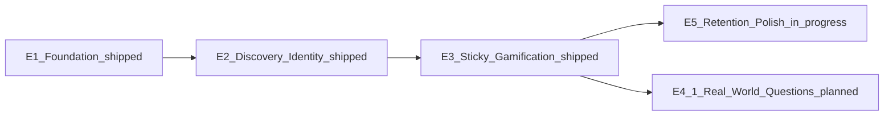

# Problem Bank — AI agent handoff

**Last updated:** 2026-09-13  
**Repository:** `maths_generator/physics-problem-bank` (GitHub: `kingdavidek/physics-problem-bank`)  
**Audience:** The next AI agent (or human) continuing product work  

Start here. Read the documents in the order below before changing behaviour that touches auth, grading, sessions, or the database.

---

## 1. Current product status

| Area | Status |
|------|--------|
| **Auto-correct (Phases A/B)** | Complete (GCSE CS + Maths; Python via client Pyodide) |
| **Phase G learning (G1–G7)** | Shipped (weak topics → exam revision planner) |
| **Solid-draft security bar** | Done (2026-08-01). See `docs/SOLID_DRAFT_SECURITY.md` |
| **Security + UK GDPR compliance** | **S0–S3 shipped (2026-08-26)** — `docs/SECURITY_AND_GDPR.md`. S3 is the keep-it-true calendar: **`docs/CADENCE.md`**. **Operator S0.1** (ICO fee, live contact, prune cron) is written for David in **`docs/OPERATOR_LAUNCH.md`** — do that at public HTTPS / M5, not during product tracks. |
| **Mobile polish (app-like PWA)** | **Done (M0–M4)** — foundation, practice UX, app chrome, lessons/diagrams, PWA polish + device QA. **M5–M7** HTTPS → TWA → Play Android when a production URL exists — see `docs/MOBILE.md` |
| **Phase U (UI redesign)** | **U closed.** Dark mode **D0–D3 shipped** (shell, status chips, diagrams, settings toggle). Cache: `pb-v79`. Spec: `docs/UI_REDESIGN.md` §15. **Follow-up:** settings switches may not persist (see §1.1). |
| **Engagement roadmap (E1–E3)** | **E1–E3 shipped** (assist mock smoke, `@problem_bot` QOTD card, FTS lesson search, emoji/colour avatars, study buddy, friend quiz-accuracy leaderboard). Visual tokens: `docs/ENGAGEMENT_VISUAL.md` |
| **G8 teacher / class mode** | Designed; decisions locked 2026-08-30. **Phases 0–6 complete** (teacher enable, classes, join, handle invites, roster, teacher-only remove, T0–T2 dashboards, frozen set-work, audit log, CSV, verification). `docs/G8_TEACHER_HANDOFF.md`, `docs/G8_TEACHER_REVIEW_RUBRIC.md`, `docs/POTENTIAL_FUTURE_FUNCTIONALITY.md` §2 |
| **Real-world question style (E4.1)** | **Planned, fully specified** — `docs/REAL_WORLD_QUESTIONS.md`. Third generator mode (`real_world`) across percentages, ratio, compound measures |
| **European School Integrated Science S1–S3** | **ES10 shipped** — full curriculum (46 modules, six IBL tracks, whole-suite QA). **Lesson-improvement track complete (Stages 0–7).** **Practice generator complete (Phases 0–7)** (`docs/EURSC_GENERATOR_HANDOFF.md`, `docs/EURSC_GENERATOR_REVIEW_RUBRIC.md`, canvas `eursc-generator-question-plan.canvas.tsx`). Curriculum: `docs/EUROPEAN_SCHOOL_SCIENCE.md`. **Advanced Practice modes:** operational **pilot signed 2026-09-02 (scope A)**; **S1 wave complete**; **S1–S3 waves complete and whole-matrix audit smoke green (2026-09-13)** — `scripts/test_es_advanced_matrix_audit_smoke.py` parses the matrix in the contract doc and verifies 46 slugs / 243 cells / 729 variants / 33 fail-closed cells. Content-complete; David closes the track after a live visual pass. Contract: `docs/EURSC_ADVANCED_QUESTIONS.md` |
| **Guide & celebration (E6 / Phase A)** | **A1–A6 + B shipped** (origin, badge/streak/first-correct/lesson-complete, five tours, `guide_json` persist + Replay intro, CSS streak fire, overlay wink/nod/shake/tap). Spec: `docs/ANIMATION_ONBOARDING.md`. Not the E4.2 mascot farm. |
| **Mascot motion + onboarding (E7)** | **Planned, decisions frozen (2026-09-20)** — CSS budget raised 226→240KB total / 199→210KB core; no third-party animation library (Lottie/GSAP/Rive stay banned); cosmetics layer on the same rig instead of a second character, automatic/content-facing first. **Phases 1 through 3 built, reviewed, committed and pushed on the live repo (2026-09-22 through 2026-09-26, including a small Phase 2 cache-bust hotfix); CI green for both. Phase 4 (ambient touches — page transition/View Transitions, combined button spring+edge press, confetti shapes/sparkle, streak-ring peek, sleeping-Zorp offline page, install-banner wave, 5 empty states) built and reviewed 2026-09-26, post-review fixes applied. Phase 5 (motion preference + polish — final phase) built 2026-09-26 — not yet committed/pushed, awaiting David's sign-off.** Spec: `docs/MASCOT_MOTION_AND_ONBOARDING.md`. |
| **Zorp expressions, poses and turning (E8)** | **D1–D5 confirmed 2026-09-29 (all recommendations).** Phase 0 (feature gate Q1–Q3 no / Q4 yes; `/styleguide#zorp-gallery` skeleton; `scripts/test_zorp_expression_smoke.py` baseline ledger; dev-only `scripts/zorp_gallery_snapshot.py`; baseline contact sheets) built 2026-09-29, committed upstream as 17b8b38. **Phase 1 (expression engine, parts library, legacy parity, 11 new faces) built 2026-09-29, not yet committed, awaiting David's review.** Spec: `docs/ZORP_EXPRESSIVENESS.md`. |
| **Engagement E5 (retention polish)** | **E5.1–E5.6 shipped.** Remaining **E5.7** web push — blocked until `docs/MOBILE.md` M5. Spec: `docs/ENGAGEMENT_E5.md` |
| **Engagement stretch (E4.2–E4.3)** | Long-term — see `docs/POTENTIAL_FUTURE_FUNCTIONALITY.md` §3.0 (mascot farm, Desmos-class graphs) |
| **Git tip (post-hardening)** | Harden commit on `main`; history purged of `data/quicktest.db` |

**Do not regress solid-draft security** when shipping engagement or mobile work. Prefer extending existing models (QOTD, social feed, gamification, search) over rebuilding them.

### 1.1 Known issues (later)

**Settings form toggles may not persist after Save.** Reproduced 2026-08-25 on `/profile/settings` (sound switch: turn on → Save → still off). Backend save works when `sound_enabled=1` is in the POST (`update_profile_settings` in `models/social.py`); the failure is the **switch UI** — the hidden checkbox often is not checked when the form submits. A debug pass that restyled the switch (`absolute` / overlay / JS button) made layout worse (giant blue track, missing pills) and was **reverted** to commit `df39094`. Do not retry overlay/absolute switch CSS. Next attempt: keep native checkbox semantics, a 44×26 in-flow hit target, no `position: absolute; inset: 0` on `.switch`, and verify the POST includes `sound_enabled` before changing chrome.

---

## 2. Reading order (required)

| Order | Document | Why |
|-------|----------|-----|
| **1** | **This file** (`docs/AI_HANDOFF.md`) | Status, reading order, invariants, engagement E1–E3 |
| **2** | `docs/ARCHITECTURE.md` | Product + system architecture, features, layout |
| **2b** | `docs/COMPLEX_MECHANISMS.md` | Deep dive: grading, generator queues, Phase G (Flask/JS/CSS roles) |
| **2c** | `docs/MOBILE.md` | Mobile polish (M0–M4) + Play Android via TWA (M5–M7) |
| **3** | `docs/SOLID_DRAFT_SECURITY.md` | Critical/high fixes just shipped; **do not regress** |
| **3b** | `docs/SECURITY_AND_GDPR.md` | S0–S3 plan. **S0–S3 are done** (S3 = calendar, not a feature). Read before touching auth, personal data, defaults, or anything that leaves the server. Calendar: `docs/CADENCE.md`. Drafts: `docs/DPIA.md`, `docs/ROPA.md`, `docs/SUBPROCESSORS.md`. Runbooks: `docs/INCIDENT_RESPONSE.md`, `docs/DATA_RIGHTS.md`, `docs/MODERATION.md`, `docs/ZAP.md` |
| **4** | `docs/POTENTIAL_FUTURE_FUNCTIONALITY.md` | G8 design (locked §2.2) + engagement E4 + other future ideas |
| **5** | `docs/API.md` | REST `/api/v1/*` contracts when touching APIs |
| **6** | `docs/DEPLOY.md` | Env, HTTPS, backups, smoke, production checklist |
| *at public launch / M5* | **`docs/OPERATOR_LAUNCH.md`** | **David’s** ICO / privacy-inbox / prune-cron checklist. Surface this when starting production HTTPS; skip it during E4.1, UI, etc. |
| *before starting E4.1* | `docs/REAL_WORLD_QUESTIONS.md` | Step-by-step plan for the real-world generator mode |
| *before European School content* | `docs/EUROPEAN_SCHOOL_SCIENCE.md` | Full curriculum plan (46 modules). **ES10 shipped** — curriculum track closed |
| *European School lesson-clarity track* | `docs/EURSC_LESSON_IMPROVEMENT_HANDOFF.md`, `docs/EURSC_LESSON_REVIEW_RUBRIC.md` | **Complete** (Stages 0–7) |
| *European School Practice generator* | `docs/EURSC_GENERATOR_HANDOFF.md`, `docs/EURSC_GENERATOR_REVIEW_RUBRIC.md`, canvas `eursc-generator-question-plan.canvas.tsx` | **Complete** (Phases 0–7) |
| *European School advanced Practice modes* | `docs/EURSC_ADVANCED_QUESTIONS.md` | **Operational pilot signed 2026-09-02 (scope A).** **S1–S3 waves complete; whole-matrix audit smoke green (2026-09-13).** Track is content-complete — David to close after a live visual pass. |
| *before starting G8 teacher / class* | `docs/G8_TEACHER_HANDOFF.md`, `docs/G8_TEACHER_REVIEW_RUBRIC.md`, `docs/POTENTIAL_FUTURE_FUNCTIONALITY.md` §2, `docs/DPIA.md` §9 | **Complete (Phases 0–6).** Do not reopen §2.2. No Leave. No T3 to teachers. |
| *redoing ES0 only* | `docs/ES0_HANDOFF.md` | Phase ES0 platform enablement; sync `main` first |
| *before starting E6 / Guide* | `docs/ANIMATION_ONBOARDING.md` | Origin story, section tours, badge/streak celebration; includes the next-agent prompt |
| *before starting E5* | `docs/ENGAGEMENT_E5.md` | Step-by-step plan for buddy v0.5, badges, QOTD week, streak freeze, avatar unlocks |
| *as needed* | `docs/EMAIL_SETUP.md` | Weekly digest only |
| *as needed* | `docs/ENGAGEMENT_VISUAL.md` | Avatar / buddy colour and emoji tokens (after E1) |
| *as needed* | `.env.example` | Local secrets and feature flags |

Word (`.docx`) copies exist for key docs. **Markdown is the source of truth** for agents.

---

## 3. Hard invariants (do not break)

1. **Never** grade algebraic / quadratic-roots answers with bare `sympify()` on untrusted strings. Use `_safe_sympify` / allowlisted `parse_expr` only (`generators/shared/answer_checkers.py`).
2. **SymPy-backed `answer_type`s** (`algebraic`, `quadratic_roots`) require a **server session** problem for `POST /api/v1/problems/check` — no client-chosen type/raw fallback.
3. **MCQ correctness** comes from session `correct_answer`, never a client `correct` boolean.
4. **Saved problems** persist only the session-generated problem — never client-supplied HTML/JSON problem bodies.
5. **`SECRET_KEY`** must be non-default outside testing; use `PB_ALLOW_DEV_SECRET=1` only for local throwaway runs.
6. **Never commit** `data/*.db`, `*.bak`, or `.env`. Smoke tests use ephemeral DB (`PB_TESTING=1` / `PB_DB_PATH`).
7. **Do not set `PB_TESTING=1` in production** (disables rate limits and CSRF exemptions used by smoke).
8. Prefer **extending** `answer_checkers`, Phase G models, and `topic_registry` — do not rebuild them.
9. **Friend-only leaderboards** for learner competition (no global public ranking of minors) — safeguarding default for E3.
10. **Never send a handle, email, or user ID to an external AI provider.** Lesson assist may send lesson text and the student's typed question only, and only when explicitly enabled.
11. **No analytics, advertising, or third-party tracking.** The site needs no cookie-consent banner precisely because none exists; adding any requires a consent flow and a rewritten privacy notice in the same release.
12. **Anything that makes a child more visible to others defaults to off.** See `docs/SECURITY_AND_GDPR.md` §S0.3.
13. **Never store a raw IP address** where a keyed hash serves the same purpose (rate-limit and usage buckets are compared, never read back).
14. **Before any new feature**, answer the four questions in `docs/SECURITY_AND_GDPR.md` §6.1 (`python scripts/ops_cadence.py feature-gate`). Privacy / ROPA / DPIA / subprocessor edits ship in the same PR if any answer is yes.
15. **EURSC questions are direct.** Never hedge a stem, option or solution with course/model meta-phrases — "in this lesson", "in this S2 model", "in this course", "at S1 level", "of the order of", "the lesson says/names", "teaching set/figure". Pupils aged 11–15 should read one clear answer, not a hint that a more accurate answer exists. `scripts/test_es_direct_wording_smoke.py` enforces this across every EURSC topic and mode; safeguarding wording about "this quiz" / "the app" is allowed.
16. **EURSC MCQ distractors are plausible misconceptions**, not off-topic filler ("a class vote", "a stored diet file", "rank classmates", "eight planets" as an age). Wrong answers should be on-topic, clearly wrong for the tier, and similar in length and grammar to the correct option. Safeguarding items keep their meaning but their wrong options are realistic alternatives ("let the class vote", "keep a private list"). `scripts/test_es_distractor_quality_smoke.py` checks distinctness, retired filler phrases and length give-aways. The same two rules apply to lesson-page prose and inline Quick Checks (`templates/eursc_science_*_lesson.html`), where the correct letter must also be spread across A–D rather than always B; `scripts/test_es_template_quickcheck_smoke.py` enforces all of that.
17. Mascot motion lives in `zorp-motion.js` + `motion.css`; every clip needs a reduced-motion variant; never add a third-party animation library.

---

## 4. How to run locally

```powershell
# From repo root
copy .env.example .env   # set SECRET_KEY, or PB_ALLOW_DEV_SECRET=1 for local only
pip install -r requirements.txt
python app.py            # binds 127.0.0.1; FLASK_DEBUG=1 for debugger

# Full smoke suite (sets testing DB automatically via run_smoke_tests.py)
$env:PB_TESTING='1'
python scripts/run_smoke_tests.py
```

Security regression of interest: `scripts/test_sympy_security_smoke.py`.

Lesson assist (optional AI): set `LESSON_ASSIST_*` / provider keys in `.env` — see `.env.example` and E1.1 below.

WSGI / production entry: `from app import app as application` (see `docs/DEPLOY.md`). Prefer `app.py` over legacy `flask_app.py`.

---

## 5. Where code lives (cheat sheet)

| Concern | Primary location |
|---------|------------------|
| Routes, schema, API, web | `app.py` |
| Topic → generator map | `topic_registry.py` |
| Lesson metadata | `topics_data.py` |
| Grading | `generators/shared/answer_checkers.py`, `sql_checker.py` |
| Lesson AI assist | `generators/shared/lesson_assist.py`, `static/js/lesson-assist.js` |
| System bot / daily QOTD card | `models/bot.py`, feed template + `/api/v1/feed` `qotd_challenge` |
| Alien buddy | `models/buddy.py`, `static/js/study-buddy.js` (legacy `buddy.js`), `templates/partials/buddy.html` SVG mascot, `templates/base.html` embed, `GET /api/v1/me/buddy`, `GET /api/v1/build-info` |
| Zorp pose kit | `models/zorp_kit.py` + `templates/partials/zorp_kit.html` stills (`zorp_kit.pose`); `/styleguide` gallery; optional `pose` on a few milestones. Not E4.2. |
| Diagrams | `models/svg_kit.py` (Jinja `svg_kit`), `static/css/diagrams.css`, `/styleguide` |
| Generators | `generators/gcse/`, `alevel/`, `myp/` |
| Phase G / social / streaks / QOTD | `models/*.py` (`qotd.py`, `social.py`, `gamification.py`, `weak_topics.py`, …) |
| G8 teacher / classes (Phases 0–6 complete) | `models/classes.py`, `models/class_progress.py`, `models/class_assignments.py`, `models/class_invites.py`, `models/class_audit.py`, `models/class_csv.py` — enable, join, handle invites, roster, teacher remove, T0–T2, frozen set-work, audit, CSV |
| Site search | `app.py` (`_unified_search`, `/api/v1/search`), `models/lesson_search.py` (FTS5 over metadata + lesson HTML), `static/js/site-search.js` |
| Avatars | `models/avatar.py`, `user_profile_settings.avatar_json`, settings picker |
| Front-end | `templates/`, `static/js/site.js` (+ feature JS) |
| Smoke / backup | `scripts/test_*_smoke.py`, `scripts/backup_sqlite.py` |

---

## 6. Engagement roadmap (E1–E5)

Near-term product work to improve retention and discovery. **E1–E3 are shipped. E5.2 (badges) is shipped.** **E4.1** (real-world question style) and the rest of **E5** are planned and have their own step-by-step docs. Light visual tokens: `docs/ENGAGEMENT_VISUAL.md`.


```mermaid
flowchart LR
  E1[E1_Foundation_shipped]
  E2[E2_Discovery_Identity_shipped]
  E3[E3_Sticky_Gamification_shipped]
  E5[E5_Retention_Polish_in_progress]
  E4[E4_1_Real_World_Questions_planned]
  E1 --> E2 --> E3
  E3 --> E5
  E3 --> E4
```

### E1 — Foundation and low-hanging fruit (weeks 1–2)

Unblocks validation and gives an immediate daily-return hook.

#### E1.1 Check AI works (lesson-assist)

| | |
|--|--|
| **Why** | Lesson assist is env-gated; easy to think it works when keys are missing or mock-only. |
| **Action** | Validate `.env` loads provider keys (`LESSON_ASSIST_API_KEY` / DeepSeek / OpenAI per `.env.example`). Hit the lesson-assist API path used by the UI and confirm **HTTP 200** with a real or mock explanation. |
| **Tests** | Add a smoke under `scripts/` (e.g. `test_lesson_assist_smoke.py`) and register it in `scripts/run_smoke_tests.py`. Prefer `LESSON_ASSIST_MOCK=1` in CI so no paid API is required; optional live-key path documented for local. |
| **Touch** | `generators/shared/lesson_assist.py`, `app.py` assist routes, `.env.example`, smoke runner |

#### E1.2 Mascot daily challenges (Chess.com-style)

| | |
|--|--|
| **Why** | QOTD (`models/qotd.py`) and activity feed (`models/social.py`) already exist; a bot challenge makes the feed feel alive and gives a daily reason to return. |
| **Action** | Create a static system user (e.g. handle `@problem_bot`). On login (or once per UTC day when the feed loads), ensure the day’s QOTD is surfaced in the user’s feed (or as a dedicated feed card) with a friendly prompt such as “The Problem Bank bot challenges you!”. Idempotent: one bot challenge per user per day. |
| **Reuse** | `models/qotd.py`, feed APIs / `list_followed_feed`, notifications if useful |
| **Safeguarding** | Bot account must be clearly non-human; no DMs; no collecting extra PII |
| **Touch** | `app.py` (login or feed seed), `models/social.py` / activity events, maybe a small template/JS feed card |

**E1 exit:** Assist smoke green in CI (mock); logged-in user sees a daily mascot/QOTD challenge in the feed. **Shipped 2026-08-15** (`scripts/test_lesson_assist_smoke.py`, `scripts/test_bot_qotd_smoke.py`, `@problem_bot` card on `/feed`).

---

### E2 — Content discovery and identity (weeks 3–4)

#### E2.1 Improve search to include lesson keywords (FTS5)

| | |
|--|--|
| **Why** | Navbar search and `/api/v1/search` already find topics/users; lesson body keywords in `topics_data.py` are underused for discovery. |
| **Action** | Index lesson titles, summaries, formulae/tips keywords via **SQLite FTS5** (rebuild/sync on deploy or lazy rebuild). Extend `_search_topics` / `_unified_search` to query FTS and rank useful hits. Keep existing navbar search UI (`static/js/site-search.js`); deepen results, don’t reinvent the bar. |
| **Touch** | `app.py` search helpers, schema init for FTS virtual table, `topics_data.py` extraction helpers, `scripts/test_user_search_smoke.py` (extend) |

#### E2.2 Avatar customisation

| | |
|--|--|
| **Why** | Ownership and recognition in feed/leaderboards without a heavy frontend stack. |
| **Action** | Add an `avatar_json` (or similar) column on `users` / profile. Lightweight CSS sprite **or** emoji + colour combos (hair / skin / accessory style fields). Settings UI to edit; show avatar on profile, feed, and friend leaderboards. |
| **Constraints** | No image-upload CDN in v1; keep payload small; Jinja-safe rendering |
| **Touch** | `app.py` schema + settings routes, `templates/profile_settings.html`, `base.html`/CSS, serializers for feed/profile |

**E2 exit:** Search returns lesson-keyword hits (including stripped lesson HTML); users can set and see a simple avatar. **Shipped 2026-08-15** (`models/lesson_search.py`, `models/avatar.py`, `scripts/test_user_search_smoke.py`, `scripts/test_avatar_smoke.py`).

---

### E3 — Sticky gamification (weeks 5–6)

#### E3.1 Alien buddy (Duolingo-style)

| | |
|--|--|
| **Why** | Persistent encouragement without rewriting G1–G7; uses weak topics / streaks you already compute. |
| **Action** | Small persistent character (corner widget) with a short message set: celebrate quiz completion, warn about streak risk, suggest a weak topic from G1 (`analyze_weak_topics` / `/api/v1/me/weak-topics`). Client-side UI + thin API or embed data in profile/session bootstrap. Respect reduce-motion / dismiss. |
| **Touch** | New small JS + CSS in `base.html`/`static/js/`, profile or layout bootstrap data from `app.py` |
| **Do not** | Block critical paths if buddy fails to load |

#### E3.2 Friend-only weekly quiz-accuracy leaderboard

| | |
|--|--|
| **Why** | Social competition without global toxicity; minors + safeguarding. |
| **Action** | Leaderboard **strictly** over follows/friends (reuse social graph). Metric: **weekly quiz accuracy** (define clearly: lesson quiz and/or generator MCQ % over last 7 UTC days). Note: `friend_effort_leaderboard` already ranks activity effort — this is a **separate accuracy board** (or a clear tab), not a replacement. **No global public ranking.** |
| **Touch** | `models/gamification.py` (or adjacent), profile / `/leaderboard/friends`, API serializers |
| **Safeguarding** | Opt-out or visibility settings respected; friend/follower scope only |

**E3 exit:** Buddy appears with at least three message types; friends can see weekly accuracy ranking among their graph. **Shipped 2026-08-15** (`models/buddy.py`, `friend_accuracy_leaderboard`, `scripts/test_buddy_smoke.py`).

---

### E4 — Content depth (stretch)

Three items were scoped in **`docs/POTENTIAL_FUTURE_FUNCTIONALITY.md` §3.0**. Only the first is worth doing now:

| Item | Verdict |
|------|---------|
| **E4.1 Real-world question styles** | **Do this** — content work plus one new mode string. Full plan: `docs/REAL_WORLD_QUESTIONS.md` |
| **E4.2 Sub-mascot story / farm** | Defer — needs its own schema, economy design, and ongoing content |
| **E4.3 Desmos-like graphing** | Defer indefinitely — embed a maintained library if graphs are ever requested |

### E5 — Retention polish (E5.1–E5.2 shipped)

Small extensions of shipped systems, specified in **`docs/ENGAGEMENT_E5.md`**. **E5.2 shipped 2026-08-16:** four extra badges (`qotd_first`, `qotd_7`, `questions_50`, `accuracy_top_friend`) plus catalog emoji on the profile.

**E5.1 shipped 2026-08-20** on `cursor/buddy-on-page-coach-embed` (merged to `main`): page-aware on-topic coach, per-type faces, all message types, server HTML embed, MCQ refetch, milestone dismiss.

**E5.5 shipped 2026-08-20:** avatar extras 🎓/🎧/⭐ unlocked by `topics_10` / `questions_25` / `streak_7` badges; server-side enforcement + locked settings UI.

**E5.3 shipped 2026-08-20:** 7-day friends-only QOTD leaderboard on `/qotd?board=week` and `GET /api/v1/qotd/week/leaderboard`.

**E5.4 shipped 2026-08-20:** weekly streak freeze — one skip per ISO week, auto-consumed after a single missed day; profile card + gamification API + softer buddy `streak_risk` copy.

**E5.6 shipped 2026-08-20:** exam revision plan Subject dropdown lists every level/subject pair and filters client-side when Level changes; mismatched POST/PUT is rejected.

Remaining E5: web push (blocked on production HTTPS / `docs/MOBILE.md` M5).

### E6 — Guide & celebration (A1–A6 + B shipped)

Origin story, first-visit section tours, and badge/streak “moments” using the existing alien buddy. **Not** E4.2 farm. Full plan: **`docs/ANIMATION_ONBOARDING.md`**.

**A1 shipped 2026-08-26:** overlay shell (`templates/partials/guide.html`), `static/js/guide.js` + origin catalog, localStorage `pb-guide-v1`. Plays once after login; Skip / Escape / reduced-motion; logged-in only.

**A2 shipped 2026-08-26:** reward modal for badges and streak 7/30/100. `celebrate.js` hooks `pbGuide.reward`; Guide records seen; confetti still fires. Origin still wins if both would show.

**A3 shipped 2026-08-26:** Practice / Profile / Daily first-visit tours. Spotlight + mobile bottom sheet. Settings / legal / auth / quiz never auto-tour. Origin still blocks tours on the same load.

**A3b shipped 2026-08-27:** Learn + Compete first-visit tours. Compete copy is friends-only; Challenges are optional, no DMs.

**A4 shipped 2026-08-27:** first-correct and lesson-complete reward modals, once each (`pb-guide-v1` rewards). Later lessons stay confetti-only. No extra CSS.

**A5 shipped 2026-08-27:** `guide_json` on `user_profile_settings` (boolean flags). Hydrate `#pb-guide-state`; PATCH merge; Settings **Replay intro**. Privacy notice + ROPA updated. localStorage remains a cache.

**A6 shipped 2026-08-27:** CSS streak fire (`pb-streak-fire`) when a 7/30/100 streak reward plays — nav chip, profile ring, medal, Profile tab. Not on tab change. No Lottie / WebM / CDN.

**B shipped 2026-08-27:** overlay CSS gestures (wink, nod, shake, tap) via catalog `gesture`. Same SVG; head/foot/eye groups. Corner buddy unchanged. Preview + styleguide Play buttons.

---

## 7. Suggested next work (priority menu)

Pick based on product priority; items are independent enough to sequence differently if needed:

Product tracks (E4.1, UI, etc.) can proceed on a local/dev site. **Do not** start `docs/OPERATOR_LAUNCH.md` until he is doing public HTTPS / M5. When that session starts, walk him through that doc first.

1. **E4.1 real-world question style** — specified, not started (`docs/REAL_WORLD_QUESTIONS.md`). Independent of G8.
2. **Continue E5:** **E5.7** (web push) only after production HTTPS (`docs/MOBILE.md` M5).
3. **Mobile M5+ / public launch** — production HTTPS (`docs/MOBILE.md`). **Gate:** `docs/OPERATOR_LAUNCH.md` (David: ICO, privacy inbox, prune cron + `PB_BACKUP_PASSPHRASE`), then `docs/DEPLOY.md`. Unblocks web push (E5.7).
4. **Compliance calendar** — keep `docs/CADENCE.md` (S3). Not a build phase.
5. **Settings switch persist** — later; see §1.1. Do not block other work on this.
6. **European School** lesson-clarity and Practice-generator tracks are **complete**. Do not reopen unless the user reports a regression. **Advanced Practice modes** (`multi_step` / `situational_multi_step`) are a **separate** track: operational pilot signed 2026-09-02 (scope A); **all three waves complete** and the **whole-matrix audit smoke green** (2026-09-13) in `docs/EURSC_ADVANCED_QUESTIONS.md`. Nothing further to author; keep `scripts/test_es_advanced_matrix_audit_smoke.py` green if the matrix or any pool changes. David closes the track after a live visual pass.
7. **G8 teacher / class mode** is **complete** (Phases 0–6). Do not add Leave, T3-to-teachers, or reopen §2.2 unless the user explicitly asks.

---

## 8. After you change things

- Run `python scripts/run_smoke_tests.py` (`PB_TESTING=1`).
- If you touch cached JS/templates, bump `site.js?v=` (and related) query params and `CACHE_VERSION` in `static/js/sw.js`.
- Do not re-introduce tracked SQLite or bak files.
- Update `docs/ARCHITECTURE.md` / this handoff when behaviour or status changes materially; move shipped E-items into Architecture and mark Done here.

---

## 9. Active work handoff — G8 complete; EURSC advanced content complete, audit green (2026-09-13)

**S0–S3 GDPR/security shipped.** S3 is the calendar in **`docs/CADENCE.md`**. Remaining **human** work at public HTTPS: **`docs/OPERATOR_LAUNCH.md`** — not during a product session unless asked.

**EURSC lesson-clarity and Practice-generator tracks are complete.** Do not reopen without a regression.

**EURSC advanced Practice modes — pilot signed 2026-09-02 (scope A); S1 wave, S2 wave (3.1–3.3) and S3 wave (4.1 Machines, 4.2 Living Earth, 2026-09-13) complete; whole-matrix audit smoke green.** Contract: `docs/EURSC_ADVANCED_QUESTIONS.md`. Health: `healthy_living`, `noninfectious_disease`, `dependence_addiction`, `tobacco` MS (I/D) + SMS (F/I/D); `infectious_disease` MS (F/I/D) completes the pilot slug. Content: `generators/eursc/s{1,2,3}_unit*_advanced.py`; per-unit smokes `scripts/test_es_s*_unit*_advanced_smoke.py`; audit `scripts/test_es_advanced_matrix_audit_smoke.py` (parses the matrix tables in the contract doc — the doc is the source of truth). S3 content gates: `force_work_machines` never mentions power/watts (`POWER_RE`), `electric_current` never mentions V=IR/resistance/ohms (`VIR_RE`), both scanned over option banks too. Senses: `smell` and `interoception` are SMS-only (MS stays —); `touch`/`taste`/`proprioception_balance` have no foundational SMS. Full runner 81/83 on 2026-09-12 — the two failures (`test_answer_check_smoke.py` ethics `pick_counts`; `test_es_science_svg_smoke.py` expecting `{{ force_vectors_fig }}` in the force/work lesson template, which is the uncommitted local template) pre-date this batch. **Content is complete.** Remaining: David's live-server visual pass on Practice home for a sample of advanced cells, then he marks the track closed here and in the contract doc. The per-part class-work score UI noted at pilot sign-off stays optional. Do not fill excluded cells (`reproductive_anatomy` SMS, `smell` MS, `interoception` MS, etc.). Do not change lesson banks, QOTD, or the standard five-slot recipe.

**G8 teacher / class mode is complete** (Phases 0–6). Verification smoke: `scripts/test_g8_phase6_smoke.py`. Full suite **71/71**. Post-track audit 2026-09-01 (join/invite/class-work hardening). No T3 to teachers. No student Leave.

**E7 (mascot motion + onboarding) Phase 1 built 2026-09-22, awaiting David's visual review.** Decisions frozen in `docs/MASCOT_MOTION_AND_ONBOARDING.md` §2 #1-13 (rig-only, WAAPI, no library, cosmetics not a second character, CSS budget raised). New: `static/css/motion.css` (2,288 bytes — pivots, CSS idle breathe/sway loop, reduced-motion block) and `static/js/zorp-motion.js` (`window.pbZorp`: `bind/play/idle/setFace/motionLevel`, WAAPI clips `idle/blink/cheer/wobble/think/wave/point/nod/wink/tap/shake`). `templates/partials/buddy.html` gained rig groups (`buddy-root/shadow/arms/body/antennae/pupils`); every path is byte-identical otherwise except the body ellipse, which gained `class="buddy-body-shape"` (needed for the reduced-motion cheer pulse). `study-buddy.js` binds the corner buddy and starts idle; `applyFace` now goes through `pbZorp.setFace` with a fallback. Dev demo sections added to `/styleguide` (`#zorp-motion`) and `/guide-preview`. Cache bumped to `pb-v85`; build-info `study_buddy_js` is now `v8`. `react()` and changing the `pb-buddy-refetch` hop to `play('nod')` are deferred to Phase 2 (D1/D2 in the spec). `scripts/test_zorp_motion_smoke.py` now runs the Phase 0 checks plus the Phase 1 rig/runtime/dev-page checks. Full suite 91/91. Phase 1.5 follows after David's sign-off.

**E7 Phase 1.5 (automatic-only cosmetics) built 2026-09-23.** `data-mouth` swaps a mouth `<path>` on the resting `.buddy-face--nudge` face only (`buddy-mouth--smile/--grin/--cat`, one painted at a time via `display`); the other six faces are untouched. New scoped custom properties `--zorp-body`/`--zorp-accent`/`--zorp-limb` (fallback to `--brand-500`/`--brand-400`/`--brand-700`, `--brand-*` never redefined) with three presets — `violet`/`sunny`/`mint` — built from `--xp-*`/`--streak-*`/`--chem-*`. Antenna/foot size uses the CSS `scale` property so it composes with the existing idle-sway/WAAPI clips. Selection is server-side and automatic only: `models/gamification.py`'s `latest_pose_milestone()` (latest earned catalog milestone with a pose) feeds `models/zorp_kit.py`'s new `live_look()`, rendered by `buddy_mascot(look=...)` in `base.html`/`guide.html`; no pupil-facing picker, no stored preference. `motion.css` is 4,028 bytes (cap 8,000); `CSS_BUDGET_BYTES`/`CSS_CORE_BUDGET_BYTES` were **not** raised. Cache bumped to `pb-v86`. Costume/overlay-macro refactor and seasonal selection stay deferred to Phase 1.6.

**E7 Phase 1.6 (hat/shoe overlays) built 2026-09-24.** New `templates/partials/zorp_overlays.html` holds two overlay-only macros, `zorp_hat`/`zorp_shoe`, drawing gear alone in an anchor-local frame so the same art is shared, unmodified, by the pose-kit stills (`showman`/`scholar`/`chef` headwear, extracted from inline shapes with no visual change — verified byte-for-byte) and the live rig (`buddy.html`, hat as the last child of `.buddy-head`, shoes inside each foot group, plain `` Jinja). Three designs: `mortarboard` (shared/extracted), plus two new originals, `beanie` and `sneakers`, wired into `LIVE_LOOKS['wave']`/`['jump']`; `toque`/`quiff` stay kit-only in `OVERLAY_HATS`. Default `buddy_mascot()` and the unaffected pose-kit stills (explorer, all 7 action tokens) stay byte-identical to before this phase. `motion.css` untouched (still 4,028 bytes, no CSS budget raise); only `pages.css` grew ~84 bytes for a dev-only `#sg-zorp-overlays`/`.sg-zorp-hero` demo on `/styleguide` (no `/welcome` route — that's still Phase 3). Cache bumped to `pb-v87`. `test_zorp_kit_smoke.py`'s live-buddy/pose-kit separation check was tightened, not relaxed. Seasonal (non-milestone) selection was not built this phase, left for later.

**E7 Phase 2 (answer reactions) built 2026-09-24.** `celebrate.js` gained a `reactMascot()` helper (every `pbZorp` reference in the file lives inside it — verified) that calls the new `window.pbZorp.react(kind, opts)` on the next `requestAnimationFrame`, never blocking grading feedback. Six kinds — `correct`/`wrong`/`streak`/`milestone`/`lesson_complete`/`first_correct` — map to clips in `zorp-motion.js` (`wrong` is always `wobble` + a `weak_topic` face + a JS-created thought bubble, **never** the mascot `shake` clip — verified by grep); a 900ms gate covers `correct`/`wrong`/`streak` only, the other three bypass it. New `hop` clip; new JS-only thought bubble (three runtime-created SVG circles, no changes to `buddy.html`/`motion.css`, verified byte-identical). `quiz-runner.js`'s lesson-quiz-runner now routes through `pbCelebrate`; the separate quick-test runner does not (it already celebrates via `site.js`, so adding it there would double-fire). `guide.js`'s gestures now try `pbZorp.play` first (`wink`/`nod`/`shake`/`tap`/`cheer`/`wave`/`think`/`hop`), falling back to the original CSS-keyframe path only when `pbZorp` is absent. New `sound.js` tones `ding`/`soft` (soft's gain is strictly below the existing wrong tone's, checked numerically). Cache `pb-v88`, `study_buddy_js` `v9`. Full suite 91/91. Details: `docs/MASCOT_MOTION_AND_ONBOARDING.md` Phase 2.

**E7 Phase 3 (mobile welcome flow) built 2026-09-26.** New routes `welcome()` (`GET /welcome`) and `welcome_step()` (`POST /welcome/step`, CSRF, login-required) in `app.py`, plus `templates/welcome.html` and `static/js/welcome.js`. Tracks are built live from `GENERATOR_LAUNCH_PATHS`/`TOPICS` (David's decision: real routes only) — EURSC S1/S2/S3 + GCSE Maths + GCSE CS, never a hardcoded A-level/G8 list. `register()` now redirects a not-yet-welcomed user to `/welcome` instead of `/profile`. `models/social.py` gained `welcome_state()`/`set_welcome_state()` (targeted `guide_json` updates that never touch the Guide's own `v`/`origin`/`tours`/`rewards` keys) and `get_profile_settings()` now exposes `data['welcome']`; `guide_json_is_stored()` was fixed to check for the Guide's own keys specifically, so a user with only welcome keys stored doesn't wrongly flip `data-guide-persisted`. The Ready screen posts straight to the existing `/` practice route (no `?first=1` — `first_correct` already fires from Phase 2's `celebrate.js` on any correct answer). Settings gained **Replay welcome**, and the pre-existing nested-`<form>` bug in `profile_settings.html` (the Guide section) was fixed the same way: named submit buttons (`replay_guide_intro`/`replay_welcome`) inside the one main form instead of a nested form. `guide.js`'s `NEVER_TOUR` gained `welcome`; the origin story's first line now acknowledges the welcome intro ("A bit about me: …", `Novara` kept intact). `base.html`'s corner-buddy `<aside>` is now gated on `not hide_study_buddy` so `/welcome` never shows two mascots; `guide.js`/`guide-catalog.js`/`pages.css` cache versions bumped, `sw.js` `CACHE_VERSION` → `pb-v89` (no `/welcome`/`welcome.js` in the precache list, per §4). New welcome CSS lives in `pages.css` (not `motion.css`, which stays untouched — verified byte-identical, along with `partials/buddy.html`), reusing the existing bottom-bar/hero-size selectors by extending them (`.welcome-sticky-bar`/`.welcome-primary-btn`/`.welcome-hero` share rules with `.practice-new-question-bar`/`-btn` and `.sg-zorp-hero`); ~2,126 bytes added, tree now 223,295 (core 198,303), budget not raised. ROPA + both privacy notices + DPIA review log updated for the two new preferences (`level`, `topic`) and `welcome_done`; `gdpr_export_user.py`/`gdpr_erase_user.py` needed no changes (verified — `user_profile_settings` is already exported/erased wholesale). New `scripts/test_welcome_smoke.py`; `test_gdpr_smoke.py` extended to check the export includes `level`/`topic`/`welcome_done`. Full suite **92/92**. Details: `docs/MASCOT_MOTION_AND_ONBOARDING.md` Phase 3.

**E7 Phase 4 (ambient touches and page feel) built 2026-09-26, reviewed, post-review fixes applied same day.** Per David's decision, the back-vs-forward page-transition split was dropped: every navigation gets one 160ms slide-up-and-fade (`.page-shell.page-enter` in `base.css`, `backwards` fill mode so it doesn't leave a lingering transform after it ends), plus an additive cross-document View Transitions API opt-in (`@view-transition { navigation: auto; }` + matching `::view-transition-old/new(root)` rules) as a harmless Chrome/Edge progressive enhancement — no JS direction detection, `tab-bar.js` untouched; a reduced-motion media query forcibly disables every view-transition pseudo-element animation so Chrome's own default cross-fade can't leak through for reduced-motion users. Buttons: `.btn:active`/`.mcq-btn:active` combine the pre-existing edge-compression `translateY` with a new `--ease-spring` scale bounce (0.97→1.02→1) in one 140ms keyframe, folded into `practice.css`'s existing reduced-motion-gated block; reduced motion keeps the pre-existing (pre-Phase-4) translateY compression and swaps only the new scale bounce for a `filter: brightness(0.92)` flash — a deliberate scope decision (the "colour only" doc bullet is read as applying to the new bounce, not the site's long-standing edge-press language). Confetti gained a shape dimension (`confetti-bit--dot`/`--star`, alternating, all 5 existing colours kept) and `showXpFloat()` fires a small sparkle burst, both gated the same way `burstConfetti` already is. Streak-ring peek: a new, separate small inline mascot beside the ring in `profile.html` (the fixed corner buddy is untouched), gated once-per-UTC-day via `study-buddy.js`'s exact `utcDayKey()` localStorage pattern, playing a new `peek` clip. Two clips speculated in the Phase 1 doc but never built were added additively to `zorp-motion.js` (`CLIP_NAMES`/`CLIPS` only, `buddy.html`/`motion.css` verified untouched): `peek` (root slide-in + head tilt, no reduced-motion variant by design) and `sleep` (head droop via a `sleep` data-face value that matches none of `chrome.css`'s face selectors, so the face plate goes blank — no eyes/mouth drawn, not a drawn closed-eye state — with no new markup). All five per-page Zorp triggers (empty states × 5, streak-ring peek, offline) were first built as inline `<script>` blocks by the implementer — **review caught that these were dead on arrival**: this app's CSP has no `'unsafe-inline'` for script-src and none carried a nonce, so every one was silently blocked (confirmed against a live response), and even without the CSP most would have run before `zorp-motion.js`'s `defer`red script had defined `window.pbZorp`. Fixed by replacing all of them with a declarative `data-zorp-autoplay="<name>"` attribute (plus optional `data-zorp-autoplay-once-key`/`-delay`) read by a new external `static/js/zorp-triggers.js`, loaded `defer` right after `zorp-motion.js` so `window.pbZorp` is guaranteed to exist by the time it runs (named `-autoplay`, not `-clip`, so it can't collide with `styleguide.js`/`guide-preview.js`'s pre-existing `data-zorp-clip` dev-demo buttons). A second review pass then caught that `zorp-triggers.js` binds these decorative mascots into `zorp-motion.js`'s instance list before `study-buddy.js` binds/unhides the corner buddy, so `reactTarget()`'s "first visible instance" fallback (used by every ambient correct/wrong/streak/milestone celebration) could pick a decorative mascot instead — fixed with a new `isDecorative()` check in `zorp-motion.js` that skips any `data-zorp-autoplay` host, pinned by an additive smoke assertion. The offline page is the one exception: since `zorp-motion.js` is only loaded for authenticated/preview sessions and `/offline` must work for anonymous/precached views too, it sets `data-face="sleep"` directly in markup instead of calling the `sleep` clip — zero JS dependency, same blank-face look; new copy "No signal here — your saved lessons still work." `test_svg_kit_smoke.py`'s pinned `empty-spot--offline` assertion was updated to check the working implementation (`id="offline-zorp"` + `data-face="sleep"`), not the dead JS call the implementer had pinned. `test_csp_smoke.py` gained a static scan of every template for src-less `<script>` blocks with no nonce, so this class of bug can't reappear undetected. The PWA install banner gained a small `wave`-bound mascot via `pwa.js` (already an external deferred script, fired from an async event handler — no timing issue there; no `.focus()` added). Empty states: exactly David's 5 named spots (`saved_problems.html`; `leaderboard_friends.html`, both spots; `follow_list.html`; `qotd.html`'s friends-empty spot only, not its separate `caught-up` spot) swapped their icon/emoji for a `think`-bound mascot, existing copy kept verbatim. New shared `.pb-zorp-small` (56px) sizing class in `pages.css` covers every small inline mascot from this phase. Cache versions bumped for every file actually touched this phase (`base.css` v25, `components.css` v35, `chrome.css` v42, `practice.css` v28, `pages.css` v55, `pwa.js` v5, `celebrate.js` v9, `zorp-motion.js` v3 — the last one also required updating `test_buddy_smoke.py`'s pinned `zorp-motion.js?v=2` assertion) and `sw.js` `CACHE_VERSION` → `pb-v90` (so the service worker re-fetches the updated `/offline` page). CSS grew ~4,123 bytes (tree now 227,619, core 202,627; `motion.css` untouched at 4,028; budget not raised — comments in `test_u8_a11y_smoke.py` updated with measured totals). `scripts/test_zorp_motion_smoke.py` gained an additive `test_phase4_new_clips()`; no existing assertion weakened. Full suite **92/92**. Details: `docs/MASCOT_MOTION_AND_ONBOARDING.md` Phase 4.

**E7 Phase 5 (motion preference + polish — final phase) built 2026-09-26.** Per David's decision the doc's own contradictory speculation about a `<select>`/`settings_switch.html` was wrong and is corrected: `motion_preference` is a 3-option radio group (`system`/`reduced`/`off`) in `profile_settings.html`, copying `theme_preference`'s exact existing radio-group pattern, not a switch (this sidesteps the real, still-open settings-switch persistence bug by construction) and not a plain `<select>`. `models/social.py` gained `MOTION_SYSTEM`/`MOTION_REDUCED`/`MOTION_OFF`/`MOTION_CHOICES`/`normalize_motion_preference()` mirroring the `THEME_*`/`normalize_theme_preference()` pattern exactly; `get_profile_settings()`/`update_profile_settings()` gained the column. `app.py`'s schema migration, context processor, and `profile_settings()` POST handler all mirror `theme_preference` in the same style/position. `data-motion` is rendered on `<html>`, not `<body>` — matching where `data-theme` already sits. `PATCH /api/v1/me/settings` also gained `motion_preference` in `allowed_keys` plus a validation block (an addition beyond §3.6's original file list, for parity since `theme_preference` is settable there and this field is the same shape). `zorp-motion.js`'s `motionLevel()` now reads `data-motion` off `document.documentElement` first (`off`/`reduced` short-circuit before the OS-level `prefers-reduced-motion` check); every existing caller already treats anything `!== 'full'` conservatively (`play()`'s `reduced` branch, `refreshIdle()`'s `active` gate) or special-cases `'off'` directly (`react()`), so `'off'` is at least as conservative as `'reduced'` everywhere without further caller changes — verified caller-by-caller, none needed touching. CSS: one new universal `html[data-motion="reduced"], html[data-motion="off"]` catch-all block in `base.css` (mirrors the existing `prefers-reduced-motion: reduce` catch-all), plus small additive mirrors — never edits — of four specific existing reduced-motion rules that do more than zero a duration: `motion.css`'s idle-breathe/sway `animation: none` + zorp-pulse reduced fallback, `chrome.css`'s `.confetti-burst`/`.sparkle-bit` `display: none`, `base.css`'s Phase 4 view-transition pseudo-element `animation: none !important` rules, and `practice.css`'s Phase 4 button colour-only-flash override. `templates/partials/buddy.html` and `motion.css`'s default (no `data-motion` attribute) render path are unaffected — verified no existing rule was modified, only additive rules appended after existing closing braces. The IntersectionObserver for scroll-based idle-pausing was **deliberately skipped, not forgotten**: the only two continuously-idling mascots (the corner buddy and the welcome hero) are both fixed/full-screen and can never scroll out of view, so there is nothing for it to gate. The Playwright performance check was **deferred, not built** — no Playwright install/config added this phase. CSS grew ~3,151 bytes across `base.css`/`motion.css`/`chrome.css`/`practice.css` (tree now 230,770, core 205,778; budget not raised — comments in `test_u8_a11y_smoke.py` updated with measured totals). Cache versions bumped for every file actually touched (`base.css` v26, `chrome.css` v43, `motion.css` v3, `practice.css` v29, `zorp-motion.js` v4) and `sw.js` `CACHE_VERSION` → `pb-v91`; `test_buddy_smoke.py`'s pinned `zorp-motion.js?v=3`/`motion.css?v=2` assertions and `test_pwa_smoke.py`'s pinned `pb-v90` assertion were updated to match. `gdpr_export_user.py`/`gdpr_erase_user.py` needed no changes — checked directly, `user_profile_settings` is exported/erased wholesale, same as Phase 3's verified precedent. New `scripts/test_zorp_motion_smoke.py` checks: `test_phase5_motion_preference_persists()` (settings-persistence smoke mirroring `test_social_smoke.py`'s pattern, all 3 values round-trip, cycling through non-default values before returning to the default so no save is a same-value no-op, plus asserting `<html data-motion="...">` itself renders the saved value), `test_phase5_motionlevel_reads_data_motion()`, `test_phase5_css_motion_preference_mirrors()` (now also pins the universal catch-all's actual `animation-duration`/`transition-duration` declarations in `base.css`, not just the selector text, so deleting the catch-all itself — the rule that actually delivers "less motion" site-wide — would fail this test), `test_phase5_patch_motion_preference()` (PATCH rejects an invalid value with 400 `invalid_motion`, accepts a valid one and persists it); no existing assertion weakened.

**Post-review fixes (2026-09-26):** an independent reviewer found no Critical issues (smoke suite genuinely passes 92/92, PATCH validation and theme-parity all verified live against a scratch database, CSS mirroring confirmed additive-only, cache bumps confirmed with no stale pins elsewhere) but found the new CSS/persistence tests wouldn't have caught the catch-all rule going missing, and that the privacy notice/ROPA/DPIA were not updated for the new setting the way Phase 3's precedent updated them for a comparable field — both fixed directly per above. Two scope gaps were also surfaced and left as documented, not-yet-built limitations rather than blocking this phase: several JS-driven behaviors (smooth `scrollIntoView`, the Guide's one-line-at-a-time dialogue reveal) still key off the OS-level `prefers-reduced-motion` only, not `data-motion`, so a "Less motion"/"Off" user whose OS setting is unchanged still gets those specific JS-driven effects even though the CSS-driven ones are fully gated; and `motion_preference` (unlike `theme_preference`) has no client-side mirror for logged-out/precached pages (`theme.js`'s `pb-theme` localStorage/cookie + `boot-head.js`), so `/login`, `/register`, and `/offline` always render `data-motion="system"` regardless of a signed-in user's saved choice — low-impact today since those pages carry little motion, but worth fixing or re-scoping in a future pass. Full suite re-confirmed **92/92** after fixes. Details: `docs/MASCOT_MOTION_AND_ONBOARDING.md` Phase 5.

**Buddy bubble fix (2026-09-27), shipped.** The corner buddy no longer stays on permanently. Root causes fixed: `build_buddy_prompt` (`models/buddy.py`) now returns `None` when nothing applies instead of a `nudge` fallback (`_serialize_buddy_prompt`/`GET /api/v1/me/buddy` handle `None` cleanly); `milestone` moved off the bubble entirely onto the notification bell as a new `milestone_earned` notification type (`models/notifications.py`'s `create_notification` gained a `commit=False` option so `evaluate_milestones`, `models/gamification.py`, can insert one notification per newly-awarded badge inside its existing transaction — `_award_milestone`'s PK already guarantees one award per badge, so no extra dedup needed); `qotd_nudge` was removed (the Today-tab dot already covers it). Remaining bubble types, in priority order: `celebrate` → `streak_risk` → `weak_topic` → `friend_challenge` → `None` (David explicitly chose to keep `streak_risk` as a bubble). The badge celebration popup still fires once per badge: the context processor exposes `new_milestone_key` (from `models.buddy.recent_milestone`, the renamed former `_recent_milestone`, aliased for back-compat) and `base.html` renders it as a `#pb-new-milestone` JSON data island (CSP-safe, no nonce needed — confirmed against `test_csp_smoke.py`'s inline-script scan) only when a milestone was earned in the last 24h; `celebrate.js`'s `scanPageTriggers` reads that island instead of `#pb-buddy-prompt`, so it no longer depends on the buddy root being visible. `base.html`'s buddy `<aside>` is now also gated on `not quiz_runner_mode` (verified variable name, already computed from `_QUIZ_RUNNER_ENDPOINTS`) so the bubble is entirely absent during a quiz, not just hidden — `study-buddy.js` already no-ops cleanly when its root is absent. Every prompt `build_buddy_prompt` returns now carries a `task_mark` (new `buddy_task_mark()`, an opaque string from quiz/qotd/mcq counts + latest lesson-progress update + the UTC date, so a new day or a newly completed task always changes it). `study-buddy.js` replaced its whole zoo of per-type/per-day localStorage suppression keys (`pb-buddy-hide-*`, `pb-buddy-stay-*`, `pb-buddy-milestone-*`, and the milestone-ack machinery) with one `pb-buddy-quiet` key (`{until, mark}`): acting on the bubble (the primary action or any secondary link, one delegated listener on the actions container) sets a 10-minute quiet window, "Not now"/"Keep learning X" sets 30 minutes, and a bubble only shows once the window has passed **and** `task_mark` has changed (David's decision on both durations). The old bypass that showed a server-rendered "stay" bubble immediately, before any suppression check, is deleted — every source (server-embedded, fetched, and the `pb-buddy-refetch` hop after an MCQ answer) now goes through the same `maybeShow`/`shouldShow` gate; storage migrates via a `pb-buddy-storage` bump to `v3`. Cache/version pins bumped: `study-buddy.js` v23→v24, `celebrate.js` v9→v10, `sw.js` `CACHE_VERSION` `pb-v91`→`pb-v92`, build-info `study_buddy_js` `v9`→`v10`; the embed contract itself changed shape (new `task_mark` field, fewer possible `type`s, no more `data-buddy-milestone-key`), so `buddy_embed` also bumped `v4`→`v5` (`<!-- Problem Bank build: buddy-embed-v5 -->` and the `pb-buddy-embed-v5` HTML comment in `base.html`). `scripts/test_buddy_smoke.py` rewritten for the new contract (fresh user → `None`; milestone asserts a `milestone_earned` notification row + `#pb-new-milestone` instead of a bubble; `task_mark` stability/change assertions; `streak_risk` still asserted as a bubble); `scripts/test_milestones_smoke.py` gained one-notification-per-badge assertions; `scripts/test_pwa_smoke.py`'s `pb-v91` pin updated to `pb-v92`. `docs/ROPA.md` row 3 and both privacy notices were checked and left as-is — "notifications" and "badges" were already listed as data categories and a `milestone_earned` notification is the same badge data, not a new category; `models/data_export.py`/`models/account_deletion.py` already export/erase `user_notifications` wholesale, verified, no change needed. `docs/DPIA.md` review log gained a dated entry (Children's Code std 13 — fewer nudges). Full suite **92/92**.

**Same-day follow-up (2026-09-27), face-only corner Zorp + review fixes.** David's call after seeing the fully-hidden bubble: the corner Zorp **face** should stay visible even when the bubble has nothing to say, so answer reactions (`pbZorp.react()`/`reactTarget()`) and the idle loop keep working — only the speech **card** follows the quiet-period gate. `base.html`'s `<aside id="study-buddy">` is no longer `hidden` by default; the card gained its own `[data-buddy-card]` hook and starts `hidden` instead, and the root carries `data-buddy-state="face"|"card"` for CSS/debugging (the aside is still entirely absent, not just face-only, during a quiz or on `/welcome` — unchanged). `study-buddy.js`'s `show()` now unhides only the card; every hide path (the primary/extra-link click, "Not now") hides only the card and never the root. **David's other explicit call: an ignored bubble keeps showing until clicked** — no auto-quiet-on-display was added; the existing `shouldShow()`/`pb-buddy-quiet` gate (10 min acted / 30 min dismissed, keyed on `task_mark`) is otherwise unchanged. `zorp-motion.js` needed no fix: its `reactTarget()`/`rendered()` scan already works off `getClientRects()`, and the face element is a DOM sibling of the card (not nested inside it), so it stays "rendered" regardless of the card's `hidden` state — verified, not assumed, with a new smoke assertion in `test_zorp_motion_smoke.py`. Two Zorps stacking is handled in CSS only: `body:has(#pwa-install-banner:not([hidden])) .study-buddy { display: none }` hides the corner buddy while the install banner (its own small mascot, higher z-index, same footprint) is showing, and a `:has()` rule lifts the corner buddy above the full-width practice "new question" / welcome sticky bars so it's never covered. Second fix: the `#pb-buddy-prompt` JSON island is now **always** rendered when the aside renders (`{{ buddy_prompt|tojson }}`, printing `null` when there's nothing to show), and `study-buddy.js` now skips its initial `fetchBuddy()` whenever the island element exists at all (not only when it held a truthy prompt) — the server already answered the question for that load, so a null island no longer triggers a redundant client fetch on every page view. Perf nit: `app.py`'s context processor now skips `build_buddy_prompt()`/`buddy_task_mark()` on `quiz_runner_mode` and `/welcome` (the aside doesn't render on either), and skips `recent_milestone()` only for `quiz_runner_mode` (confirmed first: `guide.js`'s `isQuizRunner()` already suppresses the reward popup on quiz pages, but not on `/welcome`, so `new_milestone_key` must stay available there). Review nits also fixed: `docs/API.md`'s buddy entry rewritten for the current contract (nullable `buddy`, current type list/priority, `task_mark` described as opaque, `milestone_earned` added under notifications); `guide.js`'s `hideBuddyMilestone()` removed entirely (it only ever wrote a dead `pb-buddy-milestone-*` localStorage key — milestone dedup has been server-side, via `recent_milestone()`, since the same-day fix above — it never touched the buddy root); `models/buddy.py`'s now-orphaned `_has_qotd_today`/`_has_activity_today` helpers (flagged as a known deviation earlier the same day) are now deleted, confirmed unused first; its module docstring's stale "plus a fallback nudge" corrected. Cache/pins bumped: `study-buddy.js` v24→v25, `chrome.css` v43→v44, `guide.js` v13→v14, `sw.js` `CACHE_VERSION` `pb-v92`→`pb-v93`, build-info `study_buddy_js` `v10`→`v11`, `buddy_embed` `v5`→`v6` (embed contract changed again: root no longer hidden, island always present) including the `buddy-embed-v5`→`v6` markers in `base.html`; every stale pin found by grep across `scripts/`/`templates/`/`app.py`/`docs/` updated in the same commit (`test_buddy_smoke.py`, `test_pwa_smoke.py`, `test_guide_smoke.py`, `docs/MASCOT_MOTION_AND_ONBOARDING.md`'s pins-table row). CSS grew ~1,593 bytes in `chrome.css` only (tree now 232,501, core 207,509; budget not raised — comment in `test_u8_a11y_smoke.py` updated with measured totals). New `scripts/test_buddy_gate_smoke.py` shells out to Node (`scripts/buddy_gate_harness.js`, a small hand-rolled fake DOM/localStorage — no jsdom/npm deps, none are available offline) to exercise the real `study-buddy.js` source directly: prompt shows the card; primary/extra-link click and "Not now" hide only the card and keep the root visible while setting the 10/30-minute quiet window; an unchanged `task_mark` stays quiet even once the window passes; a changed `task_mark` shows again; an ignored bubble persists across a fresh load; a throwing `localStorage` doesn't crash. It skips cleanly (prints a message, exit 0) when `node` isn't on `PATH`. Full suite **93/93** (`ruff check .` clean). **Second review (same day) fixes:** the always-on face is now click-through (`.study-buddy-face { pointer-events: none }` — nothing listens on it, and it was swallowing taps on lesson links under its 56×56 box); the practice sticky-bar lift now adds `max(0px, var(--safe-bottom) - var(--space-3))` so the bar no longer clips the face on iPhones with a home indicator (the never-matching `.welcome-sticky-bar` variant was dropped — `/welcome` doesn't render the aside); the aside gained `aria-label="Study buddy"` so screen readers don't list an unlabeled empty landmark on every page; the gate harness also clicks an extra (`[data-buddy-extra]`) link. CSS now 232,501 total / 207,509 core — core headroom is down to ~2.5 KB.

**E8 Phase 0 built 2026-09-29.** Templates, scripts and docs only: no static file, cache or sw.js change. Decisions and gate recorded in ZORP_EXPRESSIVENESS §7.1; ledger baseline in §2.1 (default instance 7,249 B / 98 el.; fullest look 8,344 B; 3 mascots on logged-in / = 21,747 B, 1,425 gzip). New smoke test_zorp_expression_smoke.py (Phase 0 guards are loose; Phase 1 enforces the caps). Snapshot tool needs Playwright + Pillow (never in requirements.txt) and exits 0 without them; runs the app in a --serve subprocess via --server-python; output in gitignored data/zorp_gallery/. Full suite 94/94.

**E8 Phase 1 built 2026-09-29.** Zorp's face is now one `g.zorp-face` with slots (cheeks, eyeL, eyeR, brows, mouth, ambient fx) drawn from one preset instead of seven hidden face groups. Data: `models/zorp_rig.py` (`CHANNELS`, `PRESETS`, `LEGACY_FACES`, `VALENCE`, `resolve_preset` failing closed to `nudge`, `face_for_prompt`, `rig_json`, `validate`). Art: `templates/partials/zorp_parts.html` (one macro per channel). `templates/partials/zorp_library.html` holds the inert `<template id="pb-zorp-parts">` and the `#pb-zorp-rig` JSON island, included in `base.html` under the same guard as `zorp-motion.js`. `buddy_mascot(look, face)` keeps the default `<svg>` open tag byte-identical (other faces add `data-expr`). Runtime: `pbZorp.setExpression`, `hasExpression`, `expressions`, `channelsOf`, `setFace` delegating to presets, a built-in legacy table if the island is missing, and a dev-only `opts.speed`. `study-buddy.js` and `guide.js` ask `hasExpression` and keep their old lists only as the no-runtime fallback. The seven legacy faces match the baseline at 0.00% pixel difference (128 px, best alignment); `streak_risk` is the upbeat heads-up look (D4) and `sleep` is now drawn. Prompt mapping still sends `streak_risk` to its own preset until Phase 5. Measured: default instance 2,454 B / 39 el., fullest look 3,624 B, library 6,959 B, island 1,359 B, logged-in `/` mascot bytes 15,680 (2,525 gzip), `zorp-motion.js` 32,353 B, `motion.css` 6,445 B; CSS caps raised to 246,000 / 216,000 with a dated entry in `test_u8_a11y_smoke.py`. Cache pins: `zorp-motion.js` v5, `motion.css` v4, `chrome.css` v45, `study-buddy.js` v26, `guide.js` v15, `styleguide.js` v5, `sw.js` `pb-v94`. `test_zorp_expression_smoke.py` now enforces the caps and the first valence rules; `scripts/buddy_gate_harness.js` gained a `pbZorp` stub and three scenarios. Snapshot tool: `--compare` now aligns cells within a few pixels and writes `faces-parity.png` and `expressions.png`.

**Product next (if the user does not name a track):** **E4.1** real-world question style real-world question style (`docs/REAL_WORLD_QUESTIONS.md`). Remaining E5 is **E5.7** web push — blocked until `docs/MOBILE.md` M5.

---
