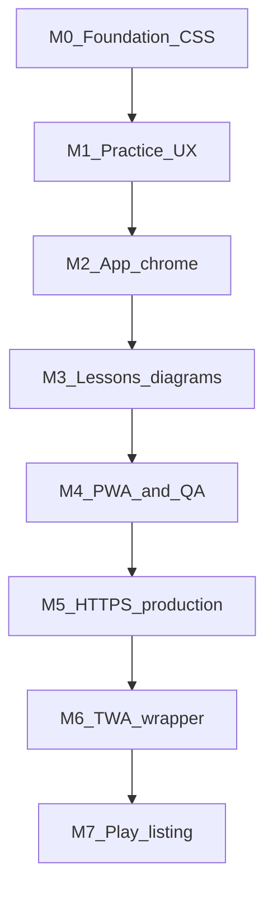
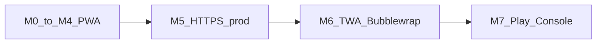

# Problem Bank — Mobile polish plan (app-like PWA)

**Last updated:** 2026-08-14  
**Status:** **M0–M3 shipped.** M4 planned — not implemented. M5–M7 gated on M4 + production URL.  
**Audience:** Next AI agent / developers  
**Companion:** `docs/AI_HANDOFF.md`, `docs/ARCHITECTURE.md`, `docs/DEPLOY.md`

## Goal

Take the site from **usable on a phone** to **basically mobile-polished and app-like** in the browser and as an installed PWA, then (optionally) ship to **Google Play for Android** via a Trusted Web Activity — **without** a separate native UI codebase.

- **In scope (M0–M4):** Responsive CSS/UX, touch targets, safe areas, keyboard, free-response/MCQ layout, lesson/diagram mobile behaviour, PWA chrome, device QA.
- **In scope (M5–M7):** Production HTTPS deploy, Digital Asset Links, TWA wrapper, Play Console listing.
- **Out of scope:** Separate native Android/iOS UI rewrite; changing grading APIs, SymPy trust rules, or Phase G/G8 backend logic; Apple App Store (call out only as later stretch).

**One product:** polish the existing Flask website so phones and desktop share it. Do **not** build a second mobile app that mirrors the site.

---

## Current baseline (assessment)

| Score | Meaning |
|-------|---------|
| **~6.5/10** | Works on a phone for core flows |
| **~4/10** | Feels like a polished mobile learning app |

**Already OK:** `viewport`, ~860px shell, partial `@media` breakpoints, PWA manifest/install banner, fluid topic grids, many SVGs `max-width: 100%`, free-response `inputmode`, lesson-assist bottom sheet on small screens.

**M0–M3 closed:** 16px form controls; 1-col forms; stacked actions; overflow-x; safe-area tokens; stacked Check; 44px taps; vertical MCQ; nav/search/notif sheets; keyboard-aware Check; `:focus-visible`; lesson accordion/CTA polish; scrolling tables/SQL; probability-tree fill-ins; Python desktop-best banner; MathJax parent scroll.

**Main remaining gap:** no formal device QA matrix (M4).

Primary CSS lives in [`templates/base.html`](../templates/base.html). Free-response markup: [`templates/partials/free_response_inline.html`](../templates/partials/free_response_inline.html).

---

## Success criteria

### After M4 (browser / installed PWA)

- [ ] No iOS focus-zoom on generate/login/check inputs
- [ ] Core flows usable one-handed on ~360px: generate → check/MCQ, lesson quiz, login, profile due-today
- [ ] Free-response multipart widgets stack; tap targets ≥44px
- [ ] Wide math/tables/SVGs scroll or scale without breaking the page
- [ ] Nav / check / assist respect safe-area and on-screen keyboard
- [ ] Installed PWA feels intentional (standalone chrome)
- [ ] Python write-code marked desktop-best (or adequately gated)
- [ ] Device QA checklist filled; `scripts/run_smoke_tests.py` still green

### After M7 (Google Play — Android)

- [ ] Production site on stable **HTTPS** with correct `SITE_URL` / Secure cookies
- [ ] `assetlinks.json` verifies the Play signing cert against the domain
- [ ] TWA (Bubblewrap or PWABuilder) opens the live site full-screen without browser URL bar in normal use
- [ ] App bundle uploaded; store listing, privacy policy, Data safety, and content rating complete
- [ ] Smoke of install-from-Play → login → generate → check on a physical Android device

---

## Principles

1. **CSS-first** in `base.html` + free-response partial; avoid per-lesson one-off mobile hacks.
2. **Do not change grading contracts** (session binding, checkers, APIs) — layout/UX only for M0–M4.
3. **App-like** = sticky chrome, full-width sheets, large hits, bottom-safe actions — not a native rewrite.
4. **Python / heavy editors** = honesty banner + progressive enhancement in v1, not a mobile IDE.
5. Ship **M0 → M4** before store work; M0+M1 alone get to “solidly usable”; M2–M4 get to “polished PWA.”
6. **Play Store = thin wrapper (TWA)** around the same HTTPS site — not a fork of templates/JS.
7. **Do not start M5–M7** until M4 exit criteria and a real production URL exist.

---

## Phase M0 — Foundation (stop the pain)

**Outcome:** Phone stops fighting the user on every form.

| Step | Task | Where |
|------|------|--------|
| M0.1 | `input` / `select` / `textarea` / free-response controls **≥16px** at `max-width: 640px` (or globally) — kills iOS zoom | `templates/base.html` — **done** |
| M0.2 | `.form-grid` → **1 column** below ~480–600px; `minmax(0, 1fr)` + select `min-width: 0` so long topic labels cannot blow out the card | `base.html` — **done** |
| M0.3 | `.problem-actions`, auth forms, profile action rows → wrap/stack full-width buttons | `base.html` — **done** |
| M0.4 | `.question`, `.answer`, `mjx-container`, tables, `pre` → `overflow-x: auto; max-width: 100%` | `base.html` — **done** |
| M0.5 | Tokens `--safe-bottom`, `--tap-min: 44px`; pad fixed UI with `env(safe-area-inset-*)` | `base.html` — **done** |
| M0.6 | Bump cache query/`CACHE_VERSION` if SW serves stale CSS/JS | `static/js/sw.js` `pb-v12` — **done** |

**Exit:** Generate + login on iPhone Safari without zoom-jump; no unintended horizontal page scroll on home. **Shipped 2026-08-11** (CSS-only; confirm on a real iPhone when convenient).

---

## Phase M1 — Practice surface (core product)

**Outcome:** Generator + Check + MCQ feel designed for thumbs.

| Step | Task | Where |
|------|------|--------|
| M1.1 | Stack `.free-response-row` variants to column; Check full-width under inputs | `base.html` — **done** (Check `flex-basis: 100%`) |
| M1.2 | Min tap size **44px** on `.btn`, `.mcq-btn`, proof chips, check buttons | `base.html` — **done** |
| M1.3 | `number_fields` / proof banks: wrap chips; labels above fields; kill horizontal min-width traps. Insert/sign chips stay compact — do not stretch full-width | `base.html` — **done** |
| M1.4 | MCQ: vertical list, large hits, clear selected/correct/wrong | `base.html` + `site.js` `is-selected` — **done** |
| M1.5 | Quick Test / saved / shared pages inherit the same free-response rules | same partial / `.mcq-options` — **done** |
| M1.6 | Smoke: answer-check + generator MCQ still pass | `PB_TESTING=1` + smoke scripts |

**Exit:** Multipart Check usable on 360px; MCQ tappable without mis-hits. **Shipped 2026-08-11** (layout/UX only).

---

## Phase M2 — App-like chrome

**Outcome:** Feels installed, not “a website with a hamburger.”

| Step | Task | Where |
|------|------|--------|
| M2.1 | Mobile nav: full-width sheet, larger hits; declutter logged-in header | `base.html`, `nav-menu.js` — **done** (bottom sheet; Profile in menu; handle hidden ≤640px) |
| M2.2 | Search + notifications as full-screen or bottom sheet on small viewports | `base.html`, `site-search.js`, `notifications.js` — **done** |
| M2.3 | Bottom-aware primary actions (Check above home indicator) | `base.html` — **done** (`--kb-inset` + sticky Check while typing) |
| M2.4 | `visualViewport` (or equivalent) so keyboard doesn’t cover Check / lesson-assist | `site.js`, `lesson-assist.js` — **done** |
| M2.5 | `:focus-visible` / `:active` — not hover-only | `base.html` — **done** |

**Exit:** One-handed nav + check-while-typing works in standalone PWA. **Shipped 2026-08-14** (layout/UX only; confirm keyboard inset on a real phone).

---

## Phase M3 — Lessons, diagrams, Python honesty

**Outcome:** Reading/diagrams don’t break; Python doesn’t trap phone users.

| Step | Task | Where |
|------|------|--------|
| M3.1 | Lesson accordions: readable padding; sticky quiz/quick-test CTAs on small screens | `base.html` — **done** |
| M3.2 | Verify wide tables/SQL boxes scroll (`overflow-x: auto`) | `base.html` + existing `.sql-box` / `.ps-code` — **done** |
| M3.3 | Probability-tree / tiny SVG inputs: larger hits **or** fallback to normal free-response under a mobile breakpoint | CSS: no shrink + 16px/44px hits + sideways scroll; hint in `site.js` — **done** |
| M3.4 | Prefer `viewBox` + `max-width: 100%` on generator SVGs | CSS already scaled diagrams; added `viewBox` on forces + MYP chemistry graphs — **done** |
| M3.5 | Python/Pyodide: “Works best on a computer” banner; optional hide Run on very narrow widths | partial + `site.js` + Python lesson; Check/Run kept, 44px Run — **done** |
| M3.6 | Long MathJax: parent scroll, no card clipping | `problem-card-inner` / `.formula-block` / `mjx-container` overflow-x — **done** |

**Exit:** Lessons readable; trees usable or degraded; Python expectation clear. **Shipped 2026-08-14** (layout/UX only).

---

## Phase M4 — PWA polish + QA + docs

**Outcome:** Confidence to call it mobile-polished in browser / Add to Home Screen. **Not** on Play Store yet.

| Step | Task | Where |
|------|------|--------|
| M4.1 | Manifest review (icons 192/512/maskable, theme, start_url, scope) | `static/manifest.webmanifest` |
| M4.2 | Install banner / standalone spacing | `pwa.js`, `base.html` |
| M4.3 | Fill device QA matrix below | this file |
| M4.4 | When done: set status to **Done (M0–M4)** here and in `docs/AI_HANDOFF.md`; regenerate `.docx` | `scripts/md_to_docx.py` |
| M4.5 | Full smoke suite green | `scripts/run_smoke_tests.py` |

### Device QA matrix (fill when implementing)

| Flow | iOS Safari | Android Chrome | Installed PWA |
|------|------------|----------------|---------------|
| Generate → typed Check | | | |
| Generate → MCQ | | | |
| Multipart / proof_steps Check | | | |
| Lesson quiz | | | |
| Login / register | | | |
| Profile due-today | | | |
| Lesson assist panel (if enabled) | | | |
| Python lesson (banner / usability) | | | |

**Exit:** M4 success criteria checked; ready for production deploy (M5).

---

## Post-M4 — Android Play Store via TWA (M5–M7)

M4 alone does **not** put the app on Google Play. Play needs an Android App Bundle. The recommended path for Problem Bank is a **Trusted Web Activity (TWA)**: a thin Android shell that opens the live HTTPS site full-screen. Same Flask app; no second frontend.

**Prerequisite gate:** M0–M4 done + willingness to run a stable public production host.

---

### Phase M5 — Production HTTPS deploy

**Outcome:** A stable public origin that cookies, sessions, CSP, and Asset Links can trust.

| Step | Task | Notes |
|------|------|--------|
| M5.1 | Deploy Flask app to production host (e.g. PythonAnywhere or equivalent) | See `docs/DEPLOY.md` |
| M5.2 | Force **HTTPS**; set `SITE_URL=https://your-domain` | Enables Secure session cookies |
| M5.3 | Set strong `SECRET_KEY`; never `PB_TESTING` / `PB_ALLOW_DEV_SECRET` in prod | Solid-draft invariants |
| M5.4 | Confirm `/api/v1/health`, PWA manifest, `/sw.js`, icons over HTTPS | No mixed-content blocks |
| M5.5 | SQLite backups on a schedule (`scripts/backup_sqlite.py`) | Ops, not Play-specific |
| M5.6 | Optional: custom domain + HSTS once DNS is stable | Reduces origin churn (Asset Links hate domain changes) |

**Exit:** Phone Chrome can open `https://…`, install PWA, log in, generate, and check against production.

**Doc touch when shipping:** note production URL in `docs/DEPLOY.md` (not secrets).

---

### Phase M6 — Trusted Web Activity (Android wrapper)

**Outcome:** A signed Android project that launches the production site as a full-screen activity.

| Step | Task | Notes |
|------|------|--------|
| M6.1 | Choose tool: **PWABuilder** (UI) or **Bubblewrap** CLI (`npx @bubblewrap/cli init`) | Prefer Bubblewrap if automating in CI later |
| M6.2 | Point wrapper at production `start_url` / manifest URL | Must match live `SITE_URL` |
| M6.3 | Generate / import Android signing key; keep keystore **offline and backed up** | Never commit keystore or passwords to git |
| M6.4 | Publish **Digital Asset Links** at `https://<domain>/.well-known/assetlinks.json` | Include Play app package name + SHA-256 cert fingerprint(s) (upload + optionally debug) |
| M6.5 | Serve `assetlinks.json` from Flask (static route or `static/.well-known/`) with `Content-Type: application/json` | Verify with Google’s statement list tester / `adb` |
| M6.6 | Build **release AAB** (`bundleRelease`) | Local Android Studio or Bubblewrap build |
| M6.7 | Sideload or internal-test the TWA: no persistent browser chrome; deep links to site work | Fix Asset Links if Chrome still shows URL bar |

**Suggested repo hygiene:** keep TWA/Android project in a sibling folder or separate repo (e.g. `physics-problem-bank-android`) so Python smoke CI stays clean; document the path in this file when created.

**Exit:** Internal Android build opens production Problem Bank full-screen; Asset Links validated.

---

### Phase M7 — Google Play listing and release

**Outcome:** Listed (or at least closed/open testing) on Play Store for Android.

| Step | Task | Notes |
|------|------|--------|
| M7.1 | Create Google Play Console developer account | One-time registration fee (~USD 25) |
| M7.2 | Create app listing: title, short/full description, screenshots (phone), feature graphic, icon | Use production PWA screenshots from M4 QA |
| M7.3 | Host a public **Privacy Policy** URL (page on site or docs) | Required; align with 13+ age gate and data you store |
| M7.4 | Complete **Data safety** form (accounts, activity, optional email digest) | Be accurate; update when features change |
| M7.5 | Content rating questionnaire (education / users 13+) | Matches product age confirm |
| M7.6 | Upload AAB to **internal testing** → closed testing → production when stable | Always smoke on a real device from the store track |
| M7.7 | Store QA checklist: install → login → generate → Check/MCQ → logout; cold start offline behaviour documented (TWA needs network for most of PB) | |
| M7.8 | Update `docs/AI_HANDOFF.md` / this file status to **Play Android shipped** (or “in testing”) | Regenerate `.docx` |

**Exit:** Testers (then public users) can install from Play and use core flows.

---

### Post-M7 notes (not part of this roadmap’s MVP)

| Topic | Guidance |
|-------|----------|
| **Apple App Store** | Separate project (often Capacitor + Apple Developer Program + stricter review). Do not block Android TWA on iOS. |
| **Push notifications** | Not free with TWA; needs Web Push + service worker and/or FCM — see future-functionality “Push notifications.” |
| **True offline** | Problem Bank is server/SQLite-backed; TWA will not magically offline-grade. Keep expectations honest in the store description. |
| **Domain change** | Re-issue Asset Links and often a new Play release; avoid renaming production origin after M6. |

---

## Suggested order for the next AI

1. Read this file and `docs/AI_HANDOFF.md` (and `docs/SOLID_DRAFT_SECURITY.md` before any grading changes — there should be none for mobile polish).
2. **M0–M3 are done.** Implement **M4** next (PWA polish, device QA matrix, status update).
3. **M3** content/diagrams; **M4** QA + status update.
4. Only then **M5** production HTTPS → **M6** TWA + Asset Links → **M7** Play Console.
5. Do **not** regress solid-draft security or session grading trust while touching templates/JS.
6. Do **not** build a parallel React Native / Flutter app unless product explicitly abandons the TWA path.

**Primary files (M0–M4):** `templates/base.html`, `templates/partials/free_response_inline.html`, `static/js/site.js`, `static/js/nav-menu.js`, `static/js/pwa.js`, `static/js/lesson-assist.js`, `static/manifest.webmanifest`, `static/js/sw.js`.

**Primary concerns (M5–M7):** `docs/DEPLOY.md`, production env, `/.well-known/assetlinks.json` route/static file, external Android/TWA project + Play Console (outside core Python tree unless vendored later).
